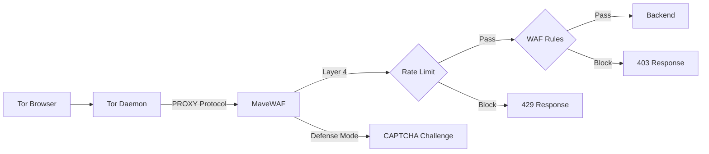

# MaveWAF

**High-Performance Reverse Proxy and WAF for Tor & I2P Hidden Services**

[](https://git.mrmave.work/maverick/mavewaf/actions)
[](LICENSE)
[](https://www.rust-lang.org/)
[](https://hub.docker.com/r/mrmave/mavewaf)
[](https://git.mrmave.work/maverick/mavewaf)

## Overview

MaveWAF is a reverse proxy with integrated WAF designed for Tor and I2P hidden services. Built on Cloudflare's **Pingora** framework, it provides **multi-layer protection**:

- **Layer 4 (Transport)**: Circuit-level rate limiting via PROXY protocol
- **Layer 7 (Application)**: Deep HTTP inspection with WAF rules

## Features

### Security
- **Circuit-Based Rate Limiting** — Per-circuit throttling via Tor's PROXY protocol
- **WAF Engine** — SQLi, XSS, Path Traversal, RFI, SSRF detection using [libinjection](https://github.com/libinjection/libinjection) + Aho-Corasick pattern matching
- **No-JS CAPTCHA** — AI-resistant, works in Tor Browser "Safest" mode
- **Adaptive Defense** — Auto-escalates based on error rates and circuit floods
- **Stateless Sessions** — HMAC-SHA256 key derivation + AES-256-GCM encryption, no database required

### Tor Integration
- **Circuit ID Extraction** — Via `HiddenServiceExportCircuitID haproxy`
- **Active Defense** — Kill circuits and enable PoW via Tor Control Port
- **I2P Support** — Built-in i2pd integration

### Performance
- **Connection Pooling** — Reuses upstream connections via `deadpool`
- **Compression** — Gzip and Brotli support
- **Async I/O** — Built on Tokio runtime

## How It Works



1. **Ingress**: Tor forwards traffic with PROXY header containing circuit ID
2. **Layer 4**: Circuit-based rate limiting before HTTP parsing
3. **Layer 7**: WAF rules inspect headers, body, and query parameters
4. **Decision**: Pass, Challenge (CAPTCHA), or Block

## Technology Stack

| Component | Technology |
|-----------|------------|
| Core Framework | [Pingora](https://github.com/cloudflare/pingora) |
| Runtime | [Tokio](https://tokio.rs) |
| WAF Detection | [libinjection](https://github.com/libinjection/libinjection), Aho-Corasick, RegexSet |
| Session Encryption | AES-256-GCM + HMAC-SHA256 |
| Connection Pool | [deadpool](https://crates.io/crates/deadpool) |
| CAPTCHA | Custom image generation with [ab_glyph](https://crates.io/crates/ab_glyph) |

## Quick Start

### Docker (Recommended)

```bash
# Pull image (Docker Hub)
docker pull mrmave/mavewaf:latest

# Alternative: Pull from Private Forgejo Registry
docker pull git.mrmave.work/maverick/mavewaf:latest

# Configure
cp docs/.env.example .env
# Edit .env with your settings

# Run
docker compose up -d
```

### Building from Source

```bash
# Clearnet
git clone https://git.mrmave.work/maverick/mavewaf.git

# Tor / Onion Service
git -c http.proxy=socks5h://127.0.0.1:9050 clone http://mavegitwskioz7tpppmjtj7fn24pwezciii3nvc7kdyltn5iu5uakfqd.onion/mavewaf

cd mavewaf
cargo build --release
./target/release/mavewaf
```

## Configuration

MaveWAF is configured via environment variables. See the [Configuration Reference](docs/README.md) for all available options.

```bash
cp docs/.env.example .env
```

### Required Variables

| Variable | Description |
|----------|-------------|
| `BACKEND_URL` | Your upstream application URL |
| `SESSION_SECRET` | 32-byte hex key ([generate](docs/README.md#session--captcha)) |
| `CAPTCHA_SECRET` | Random string for token signing |

### Tor Setup

Your `torrc` must enable PROXY protocol:

```text
HiddenServiceDir /var/lib/tor/hidden_service/
HiddenServicePort 80 127.0.0.1:8080
HiddenServiceExportCircuitID haproxy

ControlPort 127.0.0.1:9051
HashedControlPassword 16:YOUR_HASHED_PASSWORD
```

Generate Tor control password:
```bash
tor --hash-password "your_password"
```

## CAPTCHA Styles

### Simple
Standard alphanumeric challenge with slight rotation. Good for most use cases.

### Complex
High-entropy, AI-resistant challenge with:
- Aggressive visual noise
- Decoy characters
- Geometric patterns

Inspired by "Endgame DDoS" protection systems.

## Docker Compose

```yaml
services:
  mavewaf:
    image: mrmave/mavewaf:latest
    restart: unless-stopped
    env_file:
      - .env
    volumes:
      - ./tor_keys:/var/lib/tor/hidden_service/
      - ./torrc:/etc/tor/torrc:ro
      - ./i2p_keys:/var/lib/i2pd/
```

## Logging

```bash
RUST_LOG=warn           # Production
RUST_LOG=debug          # Development
LOG_FORMAT=json         # Structured output
```

All security events include: `circuit_id`, `http_method`, `http_path`, `action`, `rule`.

## Verifying Releases

### Docker Image (Cosign)

```bash
cosign verify --key cosign.pub git.mrmave.work/maverick/mavewaf:latest
cosign verify --key cosign.pub mrmave/mavewaf:latest
```

### Binary (GPG)

```bash
wget https://git.mrmave.work/maverick/mavewaf/releases/download/vX.X.X/mavewaf-vX.X.X-linux-amd64
wget https://git.mrmave.work/maverick/mavewaf/releases/download/vX.X.X/mavewaf-vX.X.X-linux-amd64.sha256
wget https://git.mrmave.work/maverick/mavewaf/releases/download/vX.X.X/mavewaf-vX.X.X-linux-amd64.asc

# Verify using WKD (Web Key Directory)
gpg --locate-keys mail@mrmave.work

# Or import manually
wget https://git.mrmave.work/maverick/mavewaf/raw/branch/master/maverick.asc
gpg --import maverick.asc

sha256sum -c mavewaf-vX.X.X-linux-amd64.sha256
gpg --verify mavewaf-vX.X.X-linux-amd64.asc mavewaf-vX.X.X-linux-amd64
```

## Limitations

- **Onion Balancer**: Currently not supported. This is planned for future development to allow scaling across multiple backend instances.
- **File Uploads**: Fully supported via `Content-Length`. Large files are buffered in memory for security inspection.

## License

[AGPL-3.0](LICENSE)
